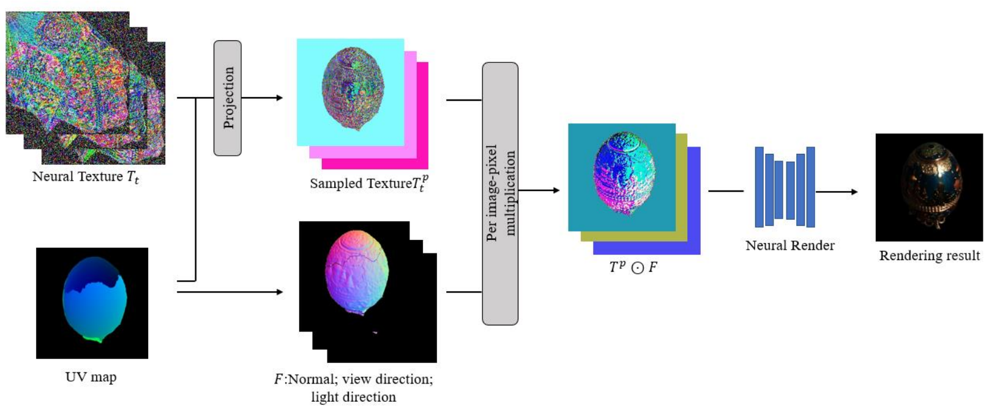
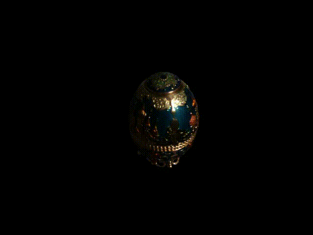
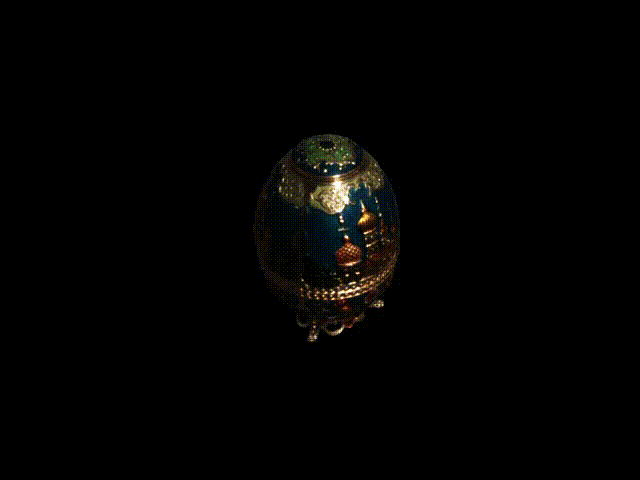

# Relighting using Neural Texture and GAN

This project use GAN to train and relight the object.

## Pipeline



## Results

**Novel View Point Synthesis**:



**Relighting**:




## Usage

1. Copy the data to folder `data/`
    - Check `stereo/` directory and file `mask_cam00.png` 
    - Copy normal map, `lights_8x8.bin` to `data/`
2. Copy the mesh to `D:\Code\Project\temp\PathTracer\PathTracer`
3. Run `gen_uv_map.py` to generate uv_map
4. Write a config file:
    - Modify OBJECT_NAME
    - Modify DATASET.NAME
    - Modify DATASET.ROOT
5. Run:
```
python train_gan_new.py --cfg <yaml config file>
```


